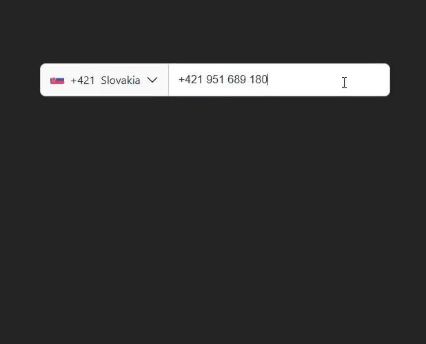

# 📞 Vue Tel Num Input

A fully customizable **phone number input** for Vue 3 with country selection, flags, masking, and localization. Built for flexibility and great DX.

## Demo ❤️



## Features

- Country selector with searchable dropdown
- Multiple flag strategies: emoji / sprite / CDN / custom
- Masking (libphonenumber-js `AsYouType` or a custom mask)
- Localized placeholders (per-locale strings)
- Global (`+1 234…`) vs national (`(234) …`) formatting
- Slots for full UI customization (button, input, list items, search)
- TypeScript-first API (exports useful types)
- Performant lists (optional virtual scroll)
- Opt-in default styles, easy to replace

## Install

```bash
npm i vue-tel-num-input
# or
pnpm add vue-tel-num-input
# or
yarn add vue-tel-num-input
```

Minimal styles (recommended):

```ts
// main.ts
import "vue-tel-num-input/css";
```

## Quick Start

```vue
<script setup lang="ts">
import { ref } from "vue";
import VueTelNumInput from "vue-tel-num-input";

const phone = ref("");
</script>

<template>
  <VueTelNumInput v-model="phone" default-country-code="US" />
</template>
```

## Why this component?

- **Flexible by default**: sensible defaults, but every piece is swappable.
- **Composable**: bring your data sources, flags, and masks.
- **DX > ceremony**: clear props, typed model, documented slots & events.
- **Performance-aware**: lazy assets, optional virtualization.

## Props

| Prop                            | Type                                    | Default                | Description                                                    |
| ------------------------------- | --------------------------------------- | ---------------------- | -------------------------------------------------------------- |
| `size`                          | `"sm" \| "md" \| "lg" \| "xl" \| "xxl"` | `"lg"`                 | Component sizing (affects row/item heights via CSS variables). |
| `disableSizing`                 | `boolean`                               | `false`                | Turn off built-in sizing classes.                              |
| `countryCodes`                  | `string[]`                              | `[]`                   | Allowlist of ISO2 codes to show.                               |
| `excludeCountryCodes`           | `string[]`                              | `[]`                   | Blocklist of ISO2 codes to hide.                               |
| `defaultCountryCode`            | `string`                                | `"US"`                 | Initial country ISO2.                                          |
| `initialValue`                  | `string`                                | `""`                   | Initial input value.                                           |
| `international`                 | `boolean`                               | `true`                 | Format as international (`+XX`) if true, national if false.    |
| `placeholder`                   | `string \| Record<string,string>`       | `"Enter phone number"` | Static placeholder or locale map.                              |
| `locale`                        | `string`                                | `-`                    | Key to pick from `placeholder` object.                         |
| `disabled`                      | `boolean`                               | `false`                | Disable input.                                                 |
| `flagSource`                    | `"emoji" \| "sprite" \| "cdn"           | `"emoji"`              | Strategy for flag rendering (emoji, sprite, CDN).              |
| `displayName`                   | `"english" \| "native"`                 | `"english"`            | Country name to display.                                       |
| `itemHeight`                    | `number`                                | size-based             | Row height override in px.                                     |
| `autoDetectCountry`             | `boolean`                               | `false`                | Detect user country on mount (best effort).                    |
| **Input options**               |                                         |                        |                                                                |
| `input.clearOnCountrySelect`    | `boolean`                               | `true`                 | Clear input when selecting a new country.                      |
| `input.focusAfterCountrySelect` | `boolean`                               | `true`                 | Autofocus input after selecting a new country.                 |
| `input.formatterEnabled`        | `boolean`                               | `true`                 | Enable libphonenumber formatting while typing.                 |
| `input.lockCountryCode`         | `boolean`                               | `false`                | Prevent user from removing/editing the country code.           |
| `input.maxLength`               | `number \| undefined`                   | `undefined`            | Optional character cap for input.                              |
| **Search options**              |                                         |                        |                                                                |
| `search.hidden`                 | `boolean`                               | `false`                | Hide search bar in dropdown.                                   |
| `search.placeholder`            | `string \| Record<string,string>`       | `undefined`            | Placeholder text or localized map.                             |
| `search.locale`                 | `string`                                | `undefined`            | Key to pick from `search.placeholder` map.                     |
| `search.clearOnSelect`          | `boolean`                               | `true`                 | Clear search query after selecting a country.                  |
| `search.autoFocus`              | `boolean`                               | `true`                 | Autofocus the search input when dropdown opens.                |
| **Prefix options**              |                                         |                        |                                                                |
| `prefix.hidden`                 | `boolean`                               | `false`                | Hide prefix button entirely.                                   |
| `prefix.hideCode`               | `boolean`                               | `false`                | Hide dialing code in prefix.                                   |
| `prefix.hideFlag`               | `boolean`                               | `false`                | Hide flag in prefix.                                           |
| `prefix.hideChevron`            | `boolean`                               | `false`                | Hide dropdown chevron.                                         |
| `prefix.hideCountryName`        | `boolean`                               | `false`                | Hide country name in prefix.                                   |
| **List options**                |                                         |                        |                                                                |
| `list.hidden`                   | `boolean`                               | `false`                | Hide country list (disables dropdown).                         |
| `list.hideCode`                 | `boolean`                               | `false`                | Hide dialing codes inside the list.                            |
| `list.hideFlag`                 | `boolean`                               | `false`                | Hide flags inside the list.                                    |
| `list.hideCountryName`          | `boolean`                               | `false`                | Hide country names inside the list.                            |
| `list.returnToSelected`         | `boolean`                               | `true`                 | Scroll back to selected country when reopening dropdown.       |
| `list.itemsPerView`             | `number`                                | `5`                    | Max visible items in dropdown before scrolling.                |

> _Flag strategy notes_
>
> - `emoji`: lightweight, zero-network, varies by OS font rendering.
> - `sprite`: best for consistent visuals offline; bundle your sprite.
> - `cdn`: smallest package size; requires network & CORS-safe CDN.

## v-model

This component uses typed object binding.
`v-model` works with a `TelInputInitModel`, giving you both the phone number and related country metadata.

```vue
<script setup lang="ts">
import { ref } from "vue";
import type { TelInputInitModel } from "vue-tel-num-input/types";

const model = ref<TelInputInitModel>({});
</script>

<template>
  <VueTelNumInput v-model="model" default-country-code="US" />
</template>
```

### TelInputInitModel shape

```ts
type TelInputModel = {
  iso: string; // Selected country ISO2 (e.g. "US")
  name: string; // Country name (localized)
  code: string; // Country calling code (e.g. "+1")
  value: string; // Raw phone number string (user input)
  search: string; // Current search query in dropdown
  expanded: boolean; // Whether the country list is open
};
```

This gives you full control over both **value** and **UI state** (selected country, search query, expanded state).

#### Important

- The model is **readonly from the outside**: you should not manually assign values into it.
- Always initialize your ref with an empty object `({})` — the component will populate and update it.
- Use it for **reading only**, all changes come from user interaction inside the component.

## Events

| Event               | Payload         | When                                    |
| ------------------- | --------------- | --------------------------------------- |
| `update:modelValue` | `TelInputModel` | After formatting/typing/country change. |
| `toggle`            | `boolean`       | Dropdown open/close toggled.            |
| `focus`             | `void`          | Input focused.                          |
| `blur`              | `void`          | Input blurred.                          |

## Slots

| Slot name            | Purpose                                      |
| -------------------- | -------------------------------------------- |
| `prefix:before`      | Before everything inside the country button. |
| `prefix:flag`        | Custom flag in the button.                   |
| `prefix:code`        | Custom code text (`+421`).                   |
| `prefix:countryName` | Custom country label.                        |
| `prefix:chevron`     | Chevron / indicator icon.                    |
| `prefix:after`       | After everything inside the button.          |
| `input`              | Replace the `<input>` entirely.              |
| `body:search`        | Replace the whole search container.          |
| `search:icon`        | Magnifier icon in search.                    |
| `search:input`       | Replace search `<input>`.                    |
| `item:before`        | Before each list row.                        |
| `item:flag`          | Flag in list rows.                           |
| `item:code`          | Code in list rows.                           |
| `item:countryName`   | Country name in list rows.                   |
| `item:after`         | After each list row.                         |

## 📤 Exposed Methods & Refs (`defineExpose`)

The component exposes an API that can be accessed via `ref`.
This allows you to programmatically control the dropdown, formatting, and access internal refs.

### Type

```ts
export type VueTelNumInputExpose = {
  /** Open/close the country dropdown programmatically */
  switchDropdown: (value?: boolean) => void;

  /** Select a specific country programmatically */
  selectItem: (data: CountryConfig) => void;

  /** Force re-formatting of the current phone number value */
  formatNow: () => void;

  /** References to DOM elements */
  inputEl: HTMLInputElement | null;
  searchEl: HTMLInputElement | null;
  telNumInputEl: HTMLElement | null;

  /** Current user country (if auto-detection is enabled) */
  country: string | null;

  /** Trigger user country detection manually */
  requestUserCountry: () => Promise<string | null>;
};
```

### Example Usage

```vue
<script setup lang="ts">
import { ref, onMounted } from "vue";
import VueTelNumInput from "vue-tel-num-input";
import type { VueTelNumInputExpose } from "vue-tel-num-input";

const telRef = ref<VueTelNumInputExpose | null>(null);

onMounted(() => {
  // Open dropdown programmatically
  telRef.value?.switchDropdown(true);

  // Format the current phone number immediately
  telRef.value?.formatNow();
});

const detectCountry = async () => {
  const iso = await telRef.value?.requestUserCountry();
  console.log("Detected country:", iso);
};
</script>

<template>
  <VueTelNumInput ref="telRef" />
  <button @click="detectCountry">Detect country</button>
</template>
```

## 🫡 Examples

#### Control visible countries

```vue
<VueTelNumInput
  v-model="phone"
  :country-codes="['US', 'CA', 'GB', 'SK', 'PL']"
/>
```

#### Use native names and CDN flags

```vue
<VueTelNumInput v-model="phone" display-name="native" :flag-source="'cdn'" />
```

#### Custom button (slots)

```vue
<VueTelNumInput v-model="phone">
  <template #prefix:flag>
    <!-- Your SVG or component -->
    <MyFlag :iso="model.iso" />
  </template>

  <template #prefix:code>
    <span class="code">Dial {{ model.code }}</span>
  </template>
</VueTelNumInput>
```

#### Localized placeholder

```vue
<VueTelNumInput
  v-model="phone"
  :placeholder="{ en: 'Phone number', sk: 'Telefónne číslo' }"
  locale="sk"
/>
```

#### Input masking via libphonenumber-js

```ts
// prop input.formatterEnabled=true enables AsYouType internally
```

OR bring your own mask by replacing the `input` slot and binding back to `v-model`.

## 💀 Types

The library exports useful types:

```ts
import type {
  TelInputModel,
  CountryConfig,
  FlagConfig,
} from "vue-tel-num-input";

// Example TelInputModel shape:
type TelInputModel = {
  iso: string; // ISO2
  name: string; // country label (native/english)
  code: string; // '+421'
  value: string; // input value
  search: string; // dropdown search query
  expanded: boolean;
};
```

> If you’re building wrappers, re-export these types from your package so users don’t need to reach inside your internals.

## ✨ CSS Variables

| Var                                    | Default                   | Notes                                                 |
| -------------------------------------- | ------------------------- | ----------------------------------------------------- |
| `--tel-input-height`                   | `40px`                    | Overall control height                                |
| `--tel-input-border-radius`            | `6px`                     | Corner radius for head & dropdown                     |
| `--tel-input-font-size`                | `14px`                    | Base font size for component                          |
| `--tel-input-padding-x`                | `12px`                    | Horizontal padding for the input                      |
| `--tel-input-icon-size`                | `12px`                    | Size for chevrons/search/flag placeholders            |
| `--tel-scrollbar-width`                | `6px`                     | Dropdown scrollbar width                              |
| `--tel-scrollbar-thumb`                | `#bbb`                    | Dropdown scrollbar thumb color                        |
| `--tel-scrollbar-track`                | `#f9f9f9`                 | Dropdown scrollbar track color                        |
| `--tel-scrollbar-radius`               | `12px`                    | Dropdown scrollbar thumb radius                       |
| `--tel-input-prefix-padding-x`         | `12px`                    | Horizontal padding inside the country button          |
| `--tel-input-prefix-gap`               | `8px`                     | Gap between flag/code/name in the button & list items |
| `--tel-input-chevron-transition-func`  | `ease`                    | Timing function for chevron rotation                  |
| `--tel-input-transition-duration`      | `0.3s`                    | Shared transition duration                            |
| `--tel-input-chevron-transition-delay` | `0s`                      | Delay for chevron transition                          |
| `--tel-input-chevron-transition-prop`  | `transform`               | Transitioned property for chevron                     |
| `--tel-input-input-width`              | `200px`                   | Width of the text input                               |
| `--tel-input-input-bg`                 | `#fff`                    | Input background                                      |
| `--tel-input-input-color`              | `#333`                    | Input text color                                      |
| `--tel-input-body-border`              | `1px solid #ccc`          | Border around the dropdown panel                      |
| `--tel-input-body-bg`                  | `#f9f9f9`                 | Dropdown background                                   |
| `--tel-input-search-outline`           | `none`                    | Outline for the search input                          |
| `--tel-input-search-border`            | `none`                    | Border for the search input                           |
| `--tel-input-search-icon-color`        | `#333`                    | Color of the search icon                              |
| `--tel-input-search-icon-margin-x`     | `12px`                    | (Preferred) Left margin of search icon                |
| `--tel-input-search-icon-margin-x`     | `12px`                    | (Current code uses this – likely a typo)              |
| `--tel-item-padding-x`                 | `12px`                    | Horizontal padding for each country row               |
| `--tel-input-body-item-border`         | `1px solid #eee`          | Divider between country rows                          |
| `--tel-input-body-item-bg`             | `#fff`                    | Country row background                                |
| `--tel-input-body-item-color`          | `#333`                    | Country row text color                                |
| `--tel-input-transition-func`          | `ease`                    | Shared transition timing function                     |
| `--tel-input-transition-delay`         | `0s`                      | Shared transition delay                               |
| `--tel-input-transition-prop`          | `background-color, color` | Shared transitioned properties                        |
| `--tel-input-body-item-hover-bg`       | `#eee`                    | Hover background for country rows                     |
| `--tel-input-body-item-hover-color`    | `#333`                    | Hover text color for country rows                     |
| `--tel-input-body-item-hover-cursor`   | `pointer`                 | Cursor on hover for country rows                      |
| `--tel-input-body-item-selected-bg`    | `#ddd`                    | Selected row background                               |
| `--tel-input-body-item-selected-color` | `#333`                    | Selected row text color                               |

You can also disable built-in sizing with `disableSizing` and style from scratch.

## 🛣️ Roadmap

- Dropdown with complete slot coverage ✅
- Multiple flag strategies ✅
- Global vs national formatting toggle ✅
- Search UX polish (clear icon, keyboard nav) ⏳
- Fully documented events & accessibility pass ⏳
- Tests 🤯

Contributions welcome — see below 🙏.

## 🧶 Accessibility

- Keyboard navigation in dropdown (planned)
- ARIA attributes on toggle and list (planned)
- Focus management on open/close (partial; improvements planned)

> If accessibility is critical in your project, review current behavior and consider contributing improvements — happy to collaborate.

## 🤝 Contributing

Contributions are very welcome! You can help by fixing bugs, improving docs, or adding features.

1. Fork the repo and create a new branch
2. `npm i` to install dependencies
3. `npm watch:build` to build the project JIT
4. `npm link` in directory folder
5. `npm link vue-tel-num-input` in your project directory
6. Commit your changes and push your branch 😍
7. Create Pull-Request
8. Thank you

For UI changes please include screenshots or gifs so it’s easy to review 🥹

👉 Bug reports and feature requests should be submitted as GitHub Issues.

## 🚧 Project Status

This component is currently in beta.
The API and behavior may still change before a stable release.

If you encounter any bugs, unexpected behavior, or have feature requests:
👉 please open an issue on [GitHub](https://github.com/MarkMinerov/vue3-tel-input/issues)

Your feedback will help improve and stabilize the component for production use.

## Notes & Caveats

- CDN flags require a CORS-safe provider; otherwise use `emoji` or `sprite`.
- `autoDetectCountry` is best-effort; always set `defaultCountryCode` as fallback.
- When `formatterEnabled` is `true`, manual cursor jumps can occur with some masks—test your locales and adjust strategy if needed.

## License

MIT © 2025 Mark Minerov
